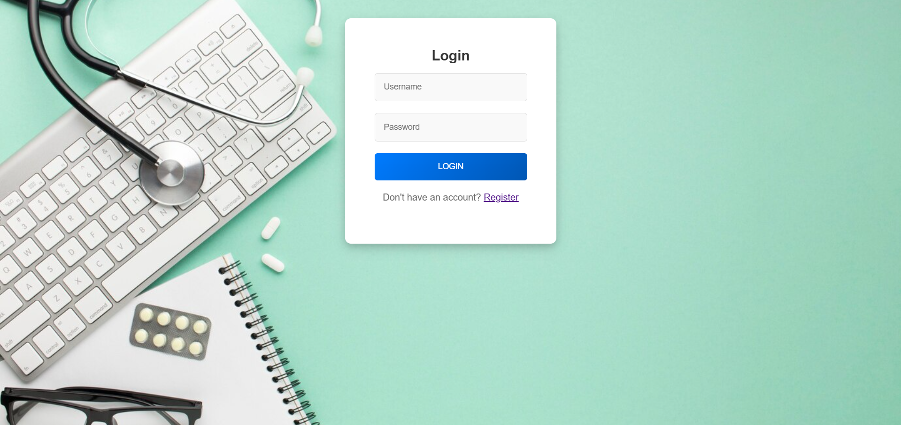

---
# DocBook - Doctor Appointment Booking System

---
## Overview
DocBook is a Django-based web application that allows patients to book appointments with doctors. It provides an intuitive platform for managing doctor schedules and patient bookings, offering seamless workflows for both parties.

---
## Features
- **User Authentication**: Patients can log in and manage their appointments.
- **Search Doctors**: Dynamic search functionality to find doctors by name or specialization.
- **View Doctor Schedules**: Patients can view available time slots and select a convenient one.
- **Appointment Management**: Patients can book, view, and confirm their appointments.
- **REST API**: Integrated API endpoints for searching doctors and managing data.
- **AI help**: Using Deepseek APIs for a simple Doctor recommendation system.
---
## Main Workflows

### Login/Register for Patients and Doctors
- The main page:

- The registration for Doctors:

- The registration for Patients:


---

### Patient Workflow
1. **Login/Registration**:
   - Registered users can manage appointments via the dashboard.
     

2. **Search Doctors**:
   - Search by name or specialization using the search bar on the dashboard.
   - Results display dynamically without reloading the page.
     

3. **View Doctor Schedule**:
   - Click on a doctor from the search results to view their available time slots.
     
   - Select a date for showing the available slots.
     

4. **Book Appointment**:
   - Select a time slot and confirm the appointment.
   - Notifications display the booking status.
     
   - Slots are color-coded:
     - **Green**: Available
     - **Blue**: Unavailable
       

5. **Dashboard Management**:
   - View all appointments with details (doctor name, appointment date).
     

6. **AI Recommendations**:
    - Use AI (deepseek model) to find the best doctor matching your needs.
     
---

### Doctor Workflow
1. **Login/Registration**:
   - Registered doctors can check the appointments and some reports via the dashboard.
     - Manage Availability: The doctor can make a day unavailable or set the slots duration.
     - Weekly Report: The doctor can view a small report of the next 7 days.
     - My appointments: The doctor can see all appointments.
         
---   

### Admin Workflow
- Admin login page.
  
   

- Admin users can manage doctors, appointments, and other related data through the Django admin panel.
  
   
---
## API Endpoints

### Frontend Views
- **Home**: `/`
- **Login**: `/login/`
- **Register**: `/register/`
- **Logout**: `/logout/`
- **Dashboard**: `/dashboard/`
- **Doctor Details**: `/doctor/<doctor_id>/`

## API Endpoints

### Doctor-related Endpoints
- **List Doctors**: `GET /api/doctors/`
- **Search Doctors**: `GET /api/doctors/search/`
- **Get Doctor Availability**: `GET /api/doctors/<doctor_id>/availability/`
- **Set Unavailability**: `POST /api/doctors/<doctor_id>/set_unavailability/`

### Appointment-related Endpoints
- **Book Appointment**: `POST /api/appointments/book/`
- **Set Unavailability**: `POST /set_unavailability/`
- **Set Slot Duration for Specific Day**: `POST /set_slot_duration_specific_day/`
- **Get Report Data**: `GET /get_report_data/`
- **Get Doctor Recommendation**: `GET /api/get_doctor_recommendation/`
---
## Technologies Used
- **Backend**: Django, Django REST Framework (DRF)
- **Frontend**: HTML, CSS, JavaScript
- **Database**: PostgreSQL
- **Authentication**: Django's built-in authentication system
- **Containerization**: Docker, Docker Compose
- **Management Commands**:  
  - `create_test_users.py`: Creates sample doctors and patients for testing.  
  - `create_random_data_for_ai_test.py`: Populates the database with random doctors, patients, appointments, ratings, and slots for AI testing.  
  - Run them using:  
    ```bash
    docker-compose exec web python manage.py <command_name>
    ```
---

## Running the Project with Docker

### Prerequisites
To run this project, you need Docker installed and running on your system.

### Steps to Run the Project
1. **Clone the repository**:
   ```bash
   git clone https://github.com/hannanrazzaghi/DocBook.git
   cd DocBook
   ```
2. **Create a .env file in the root of the project (the directory that includes Dockerfile)**:
   - Open the .env file and configure the following variables according to your preferences:
   ```bash
   # Example .env configuration
   DATABASE_NAME=docbook           # Name of the PostgreSQL database
   DATABASE_USER=admin             # Database username
   DATABASE_PASSWORD=password      # Database password
   DATABASE_HOST=db                # Hostname for the database container
   DATABASE_PORT=5432              # Port for connecting to the database
   DEBUG=1                         # Debug mode (set to 0 for production)
   DEEPSEEK_API_KEY=your_api_key   # your api key for connecting to the deepseek

   ```

3. **Build and Start the Docker Containers**:
   ```bash
   docker-compose up --build -d
   ```

4. **Run Migrations**:
   - Initialize the database schema.
   ```bash
   docker-compose exec web python manage.py migrate
   ```

5. **Create a Superuser**:
   - Set up an admin user to access the admin panel.
   ```bash
   docker-compose exec web python manage.py createsuperuser
   ```

6. **Access the Application**:
   - Open your browser and go to `http://localhost:8000/`.
   - Admin panel is accessible at `http://localhost:8000/admin/`.

7. **Stopping the Project**:
   - To stop and remove the containers:
   ```bash
   docker-compose down
   ```

---
